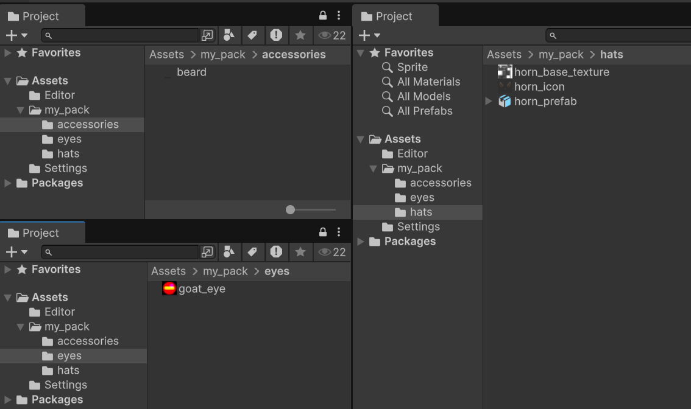
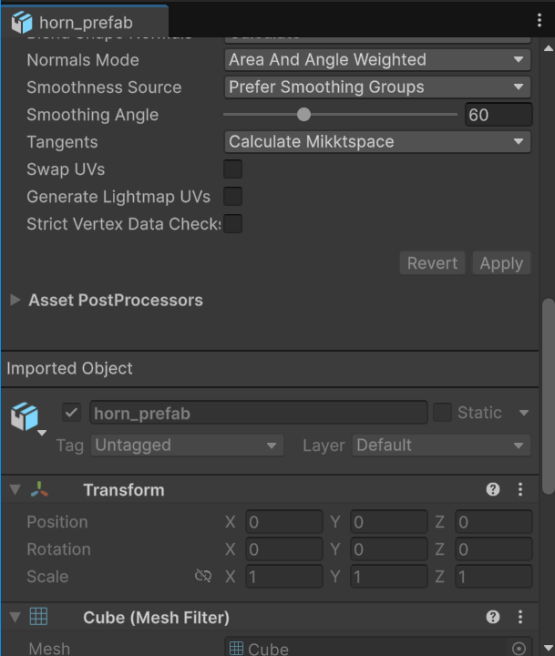
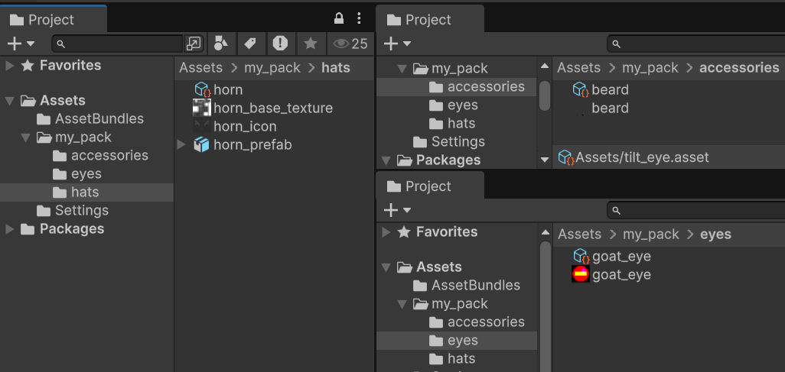

# Build asset bundle

In order to load customization with this mod, you need empty project that can produce customization files.

## Create customization asset bundle from Unity


1. Create new 'Universal 3D' project.


2. Delete all pre made asset files except `Settings`.



1. Create directory you want to pack assets, and import assets to your directory.

I'd recommend to separate them by each customization types.
- `accessories`
- `eyes`
- `mouths`
- `hats`

### Important!

Asset bundle only can have lower cases so you should use `snake_case` convention for these assets.


4. Setup imported assets for each customization types.  
   You should change import settings of your assets.  
   Click asset will make inspector shows it's import settings.
   - Accessory, Mouth
     - Check 'Alpha is Transparency'
     - Uncheck 'Generate Mipmap' in 'Advanced' foldout
     - Set Wrap Mode to 'Clamp'
   - Eye
     - Uncheck 'Alpha is Transparency'
     - Uncheck 'Generate Mipmap' in 'Advanced' foldout
     - Set Wrap Mode to 'Clamp'
     - Set Compression to 'High Quality'
   - Hat
     - For model(fbx)
       - In 'Model' tab, check 'Bake Axis Conversion'
     - For textures
       - Uncheck 'Alpha is Transparency'



For model, you should check imported prefab's transform.

You can find it easily by scroll down of model import settings.

It should has default transform values. (All zero, one scale)


1. Create directory named `Editor` at `Assets`.

And create script file named `BuildAssetBundle` with fill contents to below code snippet.

```csharp
using System.IO;
using UnityEditor;

static class BuildAssetBundle {
    
    [MenuItem("For PEAK/Build asset bundle")]
    static void Build() {
        
        var outputPath = "Assets/AssetBundles";
        
        if(!Directory.Exists(outputPath))
            Directory.CreateDirectory(outputPath);

        BuildPipeline.BuildAssetBundles(
            outputPath,
            BuildAssetBundleOptions.RecurseDependencies,
            BuildTarget.StandaloneWindows
        );
        
        AssetDatabase.Refresh();
    }
}
```


6. Set asset bundle to your customization directory.
   - Click your customization directory.
   - In bottom part of inspector, you can see 'AssetBundle',
     Click dropdown of right there, and name it your customizations asset pack name.  
     For this guide, I'll use `my_pack` for it.  
     (Same as directory name)



1. Run 'For PEAK/Build asset bundle' at top of window.  
   This will produce asset bundle file to `Assets/AssetBundles`
   as you named asset bundle name.

Note that do not rename asset bundle file!

[Now you are ready to create customization!](https://github.com/Creta5164/peak-more-customizations/tree/main/docs/create-customization.md)
