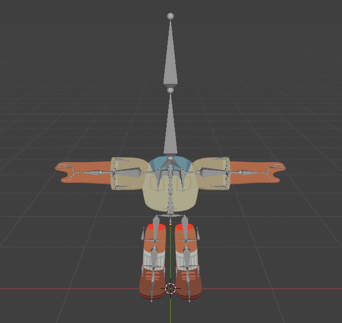
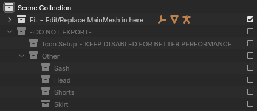
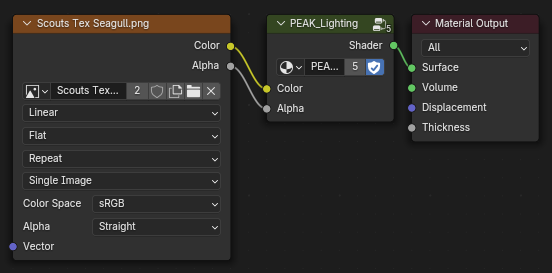
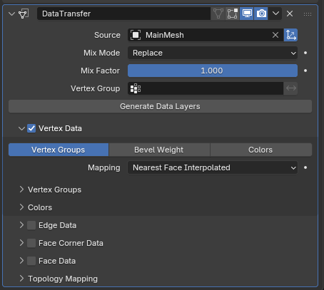
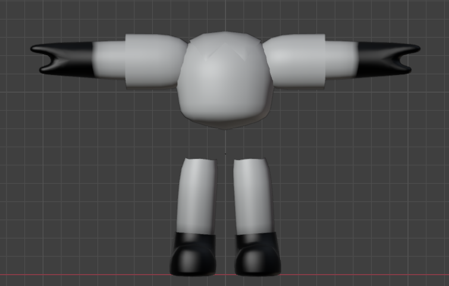
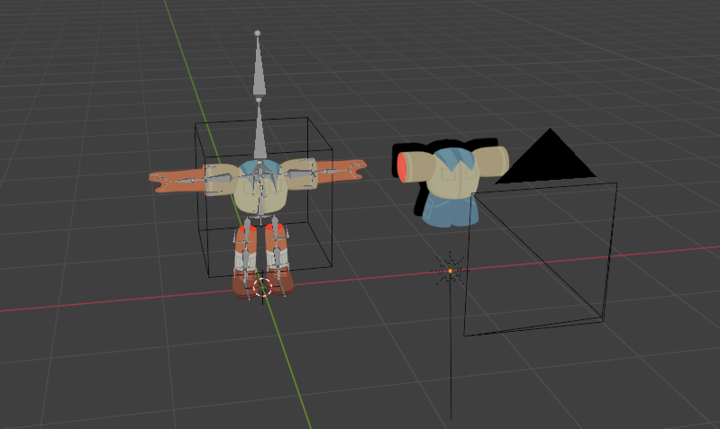
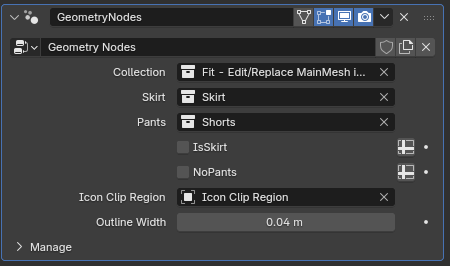
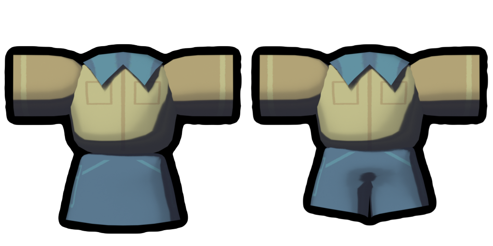
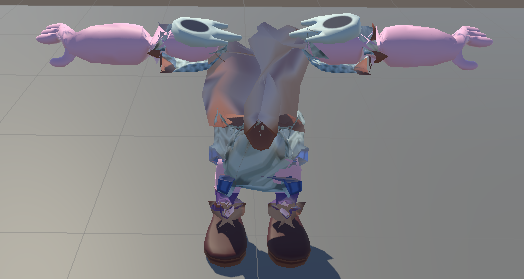

# Fit
Requires the Unity Editor (tested with 6000.0.45f but most Unity5 versions should work)  
*This guide is based on Blender (4.5).*

## Creating an Outfit 1/2 (Blender)
This guide uses Blender 4.5 to create the outfit model, but most modern blender versions should work.
This guide assumes you have some basic understanding of blender and skinning/rigging workflows.
After creating an outfit in blender you'll have to export it for further processing in Unity.

### The Template File
You can find an [outfit template `.blend` file in `templates/peak-fit-template.blend`](templates/peak-fit-template.blend).
When you open the template you should be greeted by the 'Seagull' outfit in its bind-pose.  
  
  
The template is structured into multiple collections, the `Fit` collection, which is what you will export for use in Unity, an `Icon` collection that contains a setup to generate an icon from your custom fit and a couple of miscellaneous models under the `Other` collection to preview your custom fit with a head, sash backpack and skirt or pants.  

### Editing the Fit
To create your custom fit you can either modify the existing `Fit > MainMesh` mesh or create one from scratch. 
If you decide to create a mesh from scratch, make sure to adhere to PEAK's material structure, which is listed under [Submesh Order](#submesh-order) below.

Based on how More Customizations currently handles the material creation, you can only use PEAKs existing `W/Character` shader with one color texture. 

### Creating new Materials
You can mostly reuse the existing materials from the template, however you will probably want to use your own texture for the 'Fit' material, which is initially the `M_Scout_Seagull` material.  
The template file contains a shader sub-graph with the name `PEAK_Lighting` which you can use to roughly replicate the look of PEAK.  
  
You can either paint over the existing texture or create your own material by either copying the M_Scout_Seagull or replicating the shader graph and then swapping out the `Scouts Tex Seagull.png` texture with your own. (usually `1024x1024` is a good resolution to aim for)

### Copying Existing Boneweights
If you want to quickly copy the existing weights onto a new mesh you've created from scratch or any you can use the `Edit > Data Transfer` Modifier and choose the template fit as the source, then enable the `Vertex Groups` under the `Vertex Data` category. For accurate weights with large differences in topology choose either `Nearest Face Interpolated` or `Projected Face Interpolated` for the 'Mapping' option. To ensure all of the vertex groups for all of the bones exist press the `Generate Data Layers` button once to create them.  
  
It is very likely that you will have to do some manual touch-ups if the shape of your custom fit varies a lot from the template fit, so once you've configured the modifier, apply it so you can further edit your bone weights.

You can check if your weights are correct by posing the armature in `Pose Mode`. However make sure the armature's `Data > Pose` setting is set to `Pose Position` instead of `Rest Position` or you won't be able to modify it.  
For modeling, texturing etc. and for [generating an Icon](#generating-an-icon) you should change back to `Rest Position` once you're done testing your weights or reset all of the bones transforms to the rest position.

### Vertex Colors:
Because PEAK uses Vertex Colors to determine which parts of the outfits mesh should be visible from first person you'll have to paint yours accordingly. As you can see in the image of the template below, dark colors actually indicate visibility, while bright vertex colors mark parts that are hidden in first person.
  
Anything between black and white will be partially hidden according to its brightness via a dither pattern.

### Submesh Order:
Unity creates a submeshes based on the order in which their faces appear in the `.fbx` file. This can lead to problems where the required order of the materials on the SkinnedMeshRenderer won't match what PEAK expects.  
To ensure a correct submesh order, sort your materials in blender in the following order:

0. Skin
1. Outfit
2. Shoes

Then select all of the geometry of your outfit in edit mode and use the  
`Mesh > Sort Elements... > Material`  
command with the `vertices` option selected

### Exporting your Outfit
To export your outfit for Unity, first disable all Collections exept for `Fit`. Then use the FBX Exporter with the following options:
| Include       |                               |                                               |
|---------------|-------------------------------|-----------------------------------------------|
| Limit to      | `Visible Objects`             | ensures only the `Fit` collection is exported |
| Object Types  | `Empty`, `Armature`, `Mesh`   | export only relevant objects                  |

| Transform             |                   |                                                   |
|-----------------------|-------------------|---------------------------------------------------|
| Scale                 | `1.00`            | we don't want any scale applied on the mesh       |
| Apply Scalings        | `FBX All`         | applies unit conversion from blender to FBX       |
| Forward               | `-Z Forward`      | match Unity axis                                  |
| Up                    | `Y Up`            | match Unity axis                                  |
| Apply Unit            | `False`           | already applied by Apply Scalings `FBX All`       |
| Use Space Transform   | `True`            | Applies the axis conversion on the root           |
| Apply Transform       | `True`            | Applies the axis conversion on non-root elements  |

| Animation |           |                                                               |
|-----------|-----------|---------------------------------------------------------------|
| Enabled   | `False`   | Animations are already in PEAK, no need to export them again  |

If an option was not listed above, it is probably not important but when in doubt, it can be assumed to work with the default value.

### Generating an Icon
You probably want an Icon for your outfit that fits in the general style of the other PEAK cosmetics. For this purpose the Template file contains a Geometry Nodes setup in the `Icon Setup` Collection.  
  
To use this setup, scale/position the clipping box so that it captures all of the important parts of your outfit. You should see the icon mesh update in real time as you move it around. 
Once you are happy with your clipping region you can re-position the `Icon Camera` if necessary, although keeping it at the same position is generally preferable as the resulting icon will be perfectly aligned with the other outfit icons.
To pick which `pants` object should be used, the options being `Shorts`, `Skirt` or `None` you can configure the Geometry Nodes via the modifier tab  
  
To preview your Icon you can hit `Num-0` or select the `Icon Camera` and hit `W/RMB > Set Active Camera` to switch to the view of the `Icon Camera`.

Once you're happy with your setup you can render the image via the `Render > Render Image` button or `F12`. 
If you plan on making an outfit with gendered variants (i.e. use the existing shorts and skirt), make sure to generate an Icon for each.  
  
And don't forget to save your images!

## Creating an Outfit 2/2 (Unity)
Once you're done creating the mesh for your outfit in Blender you can move onto configuring it for use in PEAK.
The rest of the steps are analogous to other cosmetics and can be found in the [build-asset-bundle](build-asset-bundle.md) guide.

### Custom_Fit_V1 Cheat Sheet
| Field                         | Description                                                                           |
|-------------------------------|---------------------------------------------------------------------------------------|
| Icon                          | The Texture for the Icon in the Passport                                              |
| Draw Under Eye                | If true, the eyes are rendered on top of the outfit at all times                      |
| Fit Mesh                      | The Mesh of the outfit we imported earlier                                            |
| Fit Main Texture              | The color texture for the second material slot                                        |
| Fit Shoe Texture              | The color texture for the third material slot                                         |
| Fit Override Pants Texture    | The color texture that can override the pants material. Leave blank to use the default pants material.                                                                                                         |
| Fit Override Pants Texture    | The color texture that can override the hat material. Only works on hats 0 and 1. Leave blank to use the default hat material.                                                                            |
| Is Skirt                      | Indicated whether the skirt or shorts mesh should be enabled for this outfit variant. |
| No Pants                      | If true, hides both the skirt and shorts mesh for this outfit. Used for outfits like the Astronaut suit, that have no gendered variants                                                                      |

## Troubleshooting
### Bone Order
If your mesh looks all scrambled up like this:  
  
after testing it in-game, you're most likely victim of an incorrect bone-order.

Since the outfit meshes in PEAK have an unusual bone order that is not sorted alphabetically, this manual reordering is necessary to allow for reusing the same SkinnedMeshRenderer at runtime that the original outfit meshes use.
For this purpose the `unity-package` contains an AssetPostprocessor called `BoneOrderFixer`, that should fix the bone order automatically. 

After importing your fit into Unity you should see a console message saying `Reordered bones for <your_outfit_name> to match PEAK™ MainMesh-es!` in the `Console` window and at the very bottom of the editor. 
This message indicates that the bone order was changed successfully to match that of the original PEAK outfits.

If you did not get any message or a message saying `Bones do not match required structure. Missing at least one bone '<some bone>'. Won't post-process this models boneorder` then your exported file either had no armature / bone-weights at all (indicated by no message) or it had a different bone structure/naming scheme than that of the template (indicated by the above message).  
In those cases double check that you've done all of the export steps correctly and that you did not rename any bones in the template file.