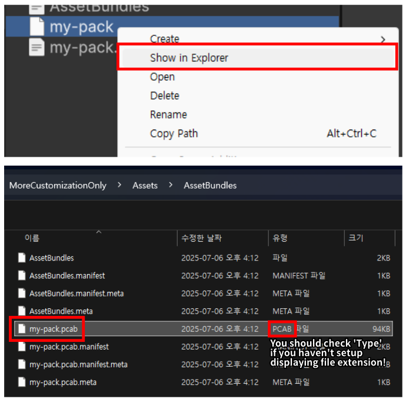
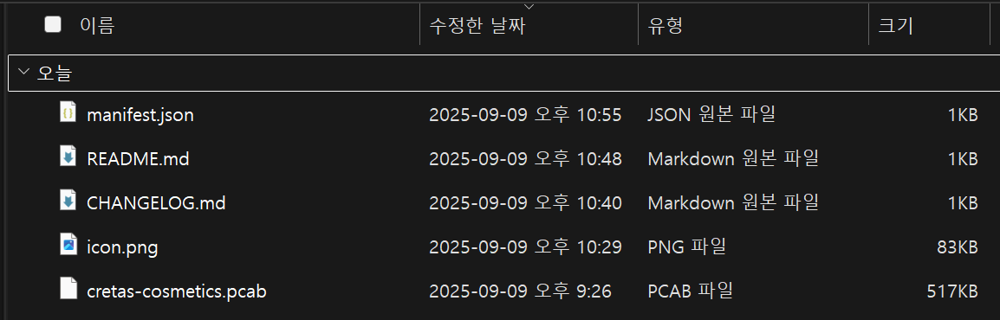

# Publish content to ThunderStore

To publish your customization file (pcab) to ThunderStore,
you must publish the files zip together with those that meet [ThunderStore's requirements](https://thunderstore.io/package/create/docs/).

If you follow that requirements, it'll be looks like this.

As shown in the image, simply place the files required by ThunderStore along with your created customization file (pcab) into a zip archive, then distribute it to ThunderStore!

> [!NOTE]  
> If you need troubleshooting to publish your customization, join [PEAK Modding Community Discord](https://discord.gg/SAw86z24rB)!
